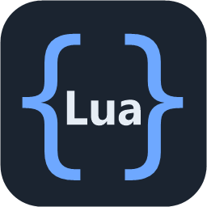
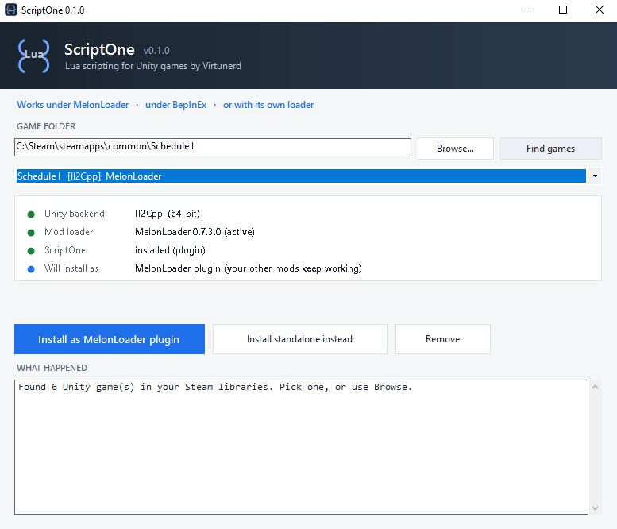
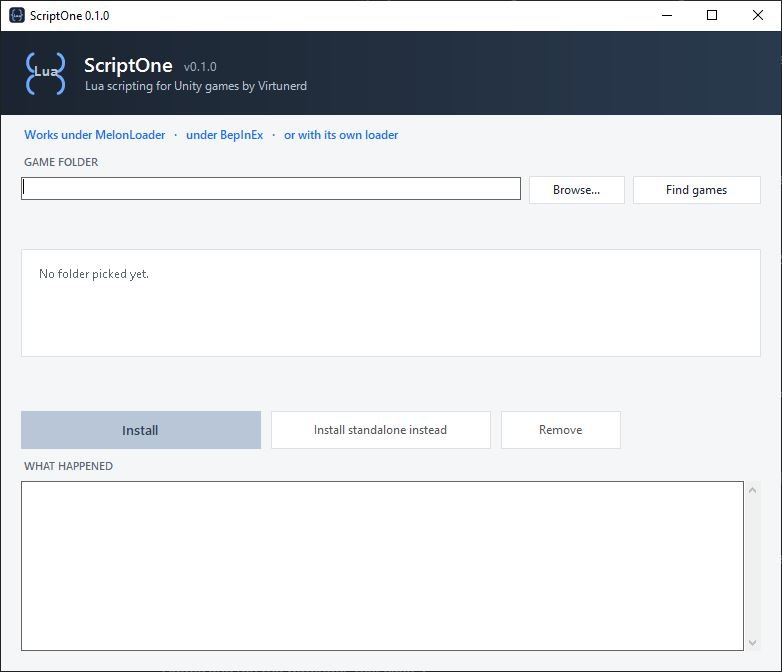
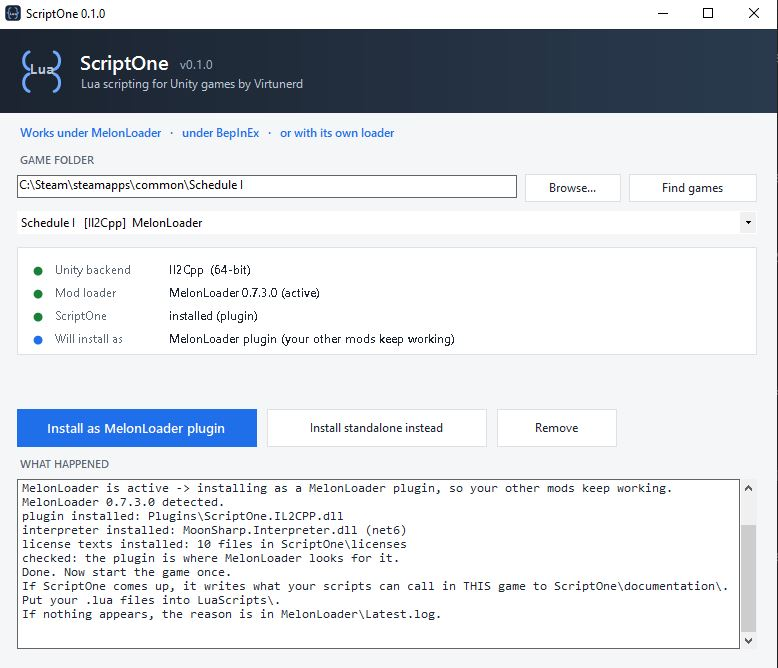
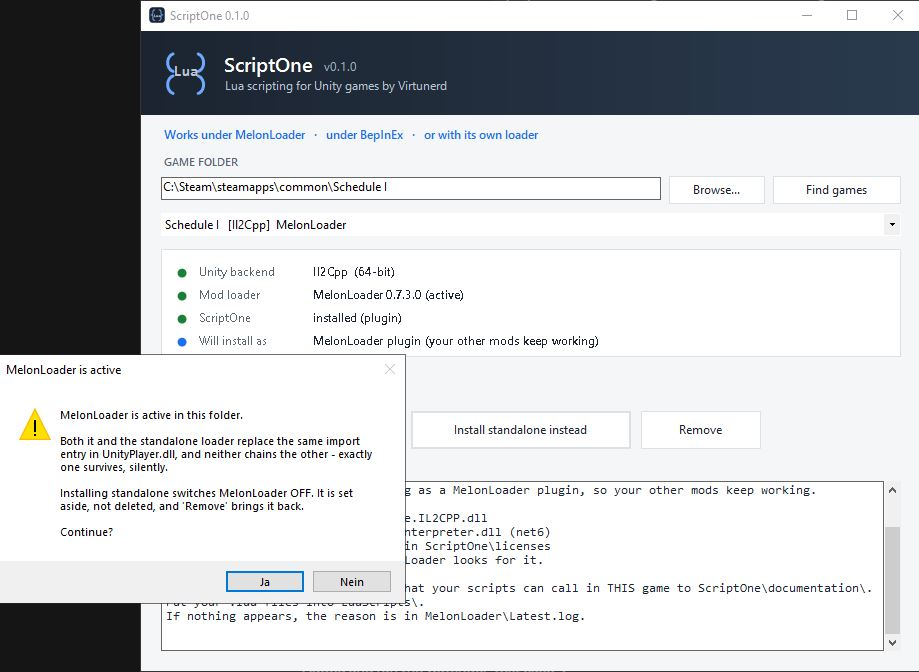
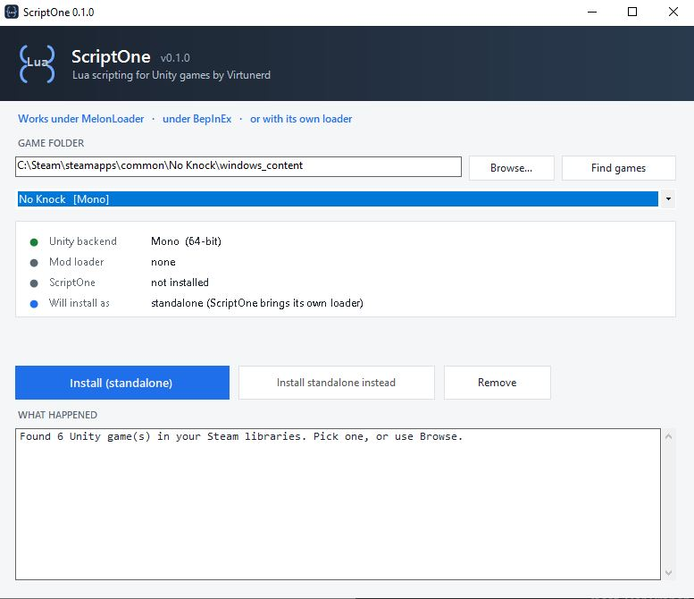
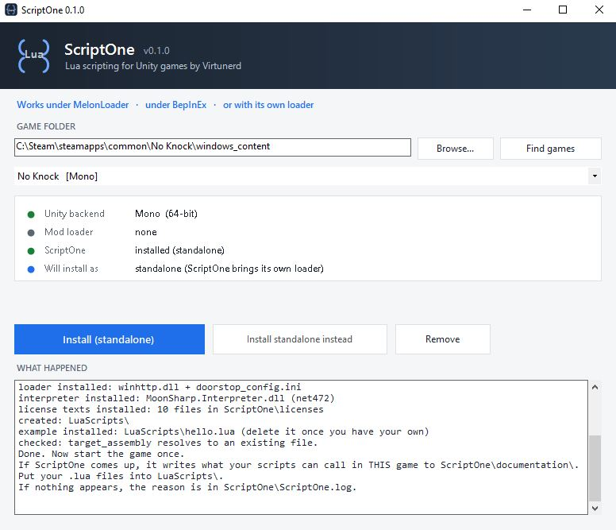
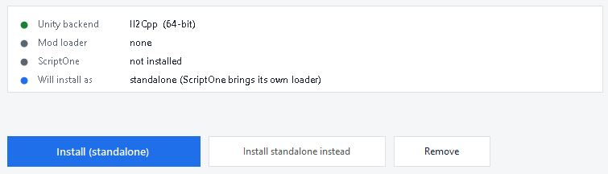

<p align="center">
  
</p>

<h1 align="center">ScriptOne</h1>

<p align="center"><b>A Lua framework for Unity games - alongside MelonLoader and BepInEx.</b></p>

<p align="center">
  Write one small text file, and the game does something new.<br>
  No C#, no compiler, no build setup - and nothing to learn beyond Lua.<br>
  ScriptOne looks inside the game you own and shows you what you can change.
</p>

<p align="center">

[](https://choosealicense.com/licenses/mit/)
[](https://github.com/ScriptOneLoader/ScriptOneLoader/releases)
[](#installation)
[](#tech-stack)
[](#installation)
[](https://www.moonsharp.org/)
[](#how-it-installs)

</p>

<p align="center">
  
</p>


## What it is

ScriptOne is a **framework**, the same kind of thing MelonLoader and BepInEx are - it just covers
a different area: **Lua**. Those two load compiled mods; ScriptOne lets a plain text file be the
mod. It works on both Unity flavours, **Mono and Il2Cpp**, and it does not compete with either
loader: it runs under MelonLoader, alongside BepInEx, or on its own when neither is installed.

**Why you might want it**

- **You can mod without being a programmer.** No Visual Studio, no compiler, no project. A text
  editor is enough.
- **It works in games nobody made a modding API for.** ScriptOne reads the game you actually
  have and writes down what can be called - that list is different in every game, and it does not
  need anyone to prepare it first.
- **Your mod is one file.** Easy to change, easy to send to a friend, easy to throw away.
- **It keeps working when things move.** New game version, or you removed your mod loader -
  ScriptOne looks again and carries on.


## Features

- **One file is the whole mod.** A `.lua` file in `LuaScripts\`, and that is it.
- **Works in games nobody wrote an API for.** The callable surface is found in *your* game at
  startup, not hand-written for one title.
- **Both Unity backends** - Il2Cpp and Mono. The installer reads which one your game is and
  installs the matching build; there is nothing for you to pick.
- **Three ways to run, decided for you** - MelonLoader plugin, alongside BepInEx, or standalone
  with its own loader.
- **It survives losing the loader.** Delete MelonLoader or BepInEx later and your scripts keep
  running - no second install, nothing to click.
- **An API reference written for your installation**, into `ScriptOne\documentation\` - what
  *this* game offers, not what some other build did.
- **Events, timers and per-script memory** that survives a restart.
- **It tells you when the frame tick is dead.** A host can start perfectly and still never see a
  frame; then timers and events are silently dead while the log looks flawless. ScriptOne says so.
- **Sandboxed by default** - no `io`, no `os`, no `require`, and a step budget that stops an
  endless loop instead of freezing your game.


## Documentation

**[The manual](docs/MANUAL.md)** - settings, what to do when the game does not start, how to
write a mod, the sandbox, and how to build it yourself.

Beyond that, ScriptOne writes an API reference **for your own installation** into
`ScriptOne\documentation\` - it lists what you can call in the game you actually have, not what
some other build offered.

| | |
|---|---|
| [docs/MANUAL.md](docs/MANUAL.md) | everything above, in one place |
| [docs/API.md](docs/API.md) | the generated surface, with per-entry markers |
| [docs/INTERNALS.md](docs/INTERNALS.md) | how the host, the loader and the installer actually work |
| [docs/CORE-VS-GAME.md](docs/CORE-VS-GAME.md) | what is game-independent and what is not |
| [CHANGELOG.md](CHANGELOG.md) | what changed, from the player's side |


## Screenshots

**On start** - nothing picked yet. `Find games` searches your Steam libraries, or point it at a
folder yourself:



The picture at the top shows the next step: it reads the folder **before any button does
anything** - Unity backend, bit width, which loader is active and in which version, whether
ScriptOne is already there, and *what it is about to do*.

**Installed as a MelonLoader plugin**, so the other mods keep working:



**It asks before it switches anything off.** Two loaders replace the same import entry in
`UnityPlayer.dll` and neither chains the other - exactly one survives, silently:



**No mod loader at all?** Then ScriptOne brings its own, and nothing else has to be installed
first:



**After the install**, with what happened spelled out - including where your scripts go and where
to look if nothing appears:



The same on an **Il2Cpp** game - the installer reads which backend it is and says so:




## Optimizations

- **The expensive part is generated once, on your machine.** The Il2Cpp proxy assemblies come
  from *your* game files, so they always match your build - and they are never regenerated when
  they already fit. Cpp2IL and Il2CppInterop.Generator are chained **in memory**, no temporary
  assembly ever hits the disk.
- **The generator ships without a single foreign runtime** - 23 files, verified at build time.
- **The Mono branch does not shrink, it disappears.** 22 assembly references against 6: the whole
  interop substructure exists only to build a managed view of a non-managed runtime, and Mono
  already has one. Mono ships **one** DLL of ours and nothing third-party but the loader.
- **The interpreter is embedded**, not a second file to lose.
- **The surface is found once, then read from a file.** The scan runs over the loaded assemblies
  at startup and is written to `ScriptOne\surface.txt`; on later starts that file wins over the
  search. Your Lua names stay put even when the game updates - and you can delete lines you do
  not want a script to reach.


## Related

- [LavaGang/MelonLoader](https://github.com/LavaGang/MelonLoader) - mod loader, ScriptOne runs as a plugin under it
- [BepInEx/BepInEx](https://github.com/BepInEx/BepInEx) - mod loader, ScriptOne runs alongside it
- [NeighTools/UnityDoorstop](https://github.com/NeighTools/UnityDoorstop) - the loader ScriptOne brings when there is none


## Tech Stack

**Host:** C#, .NET 6 (Il2Cpp branch) and .NET Framework 4.7.2 (Mono branch)

**Scripting:** Lua via [MoonSharp](https://www.moonsharp.org/) 2.0, embedded in the host DLL

**Entry point:** UnityDoorstop 4.5.0, or the loader you already have

**Installer:** a single Windows program. Everything it installs is already inside it, so the
install itself works without internet - with one exception, named where it happens: an **Il2Cpp**
game needs the matching Unity base libraries downloaded once.

**Updating ScriptOne** means downloading the newer installer from the
[releases page](https://github.com/ScriptOneLoader/ScriptOneLoader/releases) and running it once. It
updates in place and the button says `Update`. The program does not update itself and does not
check for new versions on its own - what you run is what you downloaded.


## Installation

One file: **`ScriptOne-Installer.exe`**. Double-click it, check the folder it found, press the
button.

```bash
  ScriptOne-Installer.exe                          opens the window
```

There is nothing to unpack and no build to choose - it reads the Unity backend and the bit width
out of the game's own binaries and installs the one that fits.

**Il2Cpp games need the [.NET 6 Desktop Runtime](https://dotnet.microsoft.com/download/dotnet/6.0).**
The installer looks for it and stops with a reason rather than installing something that cannot
start.

> ### 🧩 On an Il2Cpp game, the installer builds part of ScriptOne on your machine
>
> Il2Cpp games do not carry readable code. To reach one from Lua, a matching set of
> **proxy assemblies** has to be derived from **your** copy of the game - they fit that exact
> build and no other, which is why they cannot be shipped ready-made.
>
> The installer does that for you, in one step and without asking anything:
>
> 1. it reads the Unity version out of the game,
> 2. downloads the matching Unity base libraries for it (**about 3 MB**),
> 3. and derives the proxies from your game files - nothing of the game leaves your machine.
>
> It takes a moment on the first install, and it is skipped on every later one as long as the set
> still fits your game version.

On **Mono** games none of that happens: the game's own code is already readable, so there is
nothing to derive and nothing to download.

Running it again updates in place. The button says `Update` when it does.


## How it installs

| What it finds | What you get |
|---|---|
| no mod loader | ScriptOne's own loader plus the host - it runs on its own |
| **MelonLoader** active | a MelonLoader plugin, so your other mods keep working - plus a disarmed loader that stays silent and takes over by itself if you ever remove MelonLoader |
| **BepInEx** active | ScriptOne takes the entry point and starts BepInEx itself afterwards. Your plugins load as before, and ScriptOne survives you removing BepInEx later. The original `doorstop_config.ini` is saved first, and `Remove` puts it back byte for byte. |


## Deployment

Command line, for scripted installs:

```bash
  ScriptOne-Installer.exe "<game folder>" --status    report only, change nothing
  ScriptOne-Installer.exe "<game folder>"             install or update
  ScriptOne-Installer.exe "<game folder>" --remove    take it all out again
```

`--remove` means completely - config, logs, documentation, licenses, state, the script folder.
Anything it had set aside is put back **first**. An unknown option is refused rather than
ignored, so a typo cannot silently install something else.


## Usage/Examples

Put this in `LuaScripts\hello.lua`:

```lua
s1.on("game_ready", function()
    s1.log("hello from Lua - " .. s1.surface_size .. " things I can call")
end)
```

A real one, from **Schedule I** - no C#, no rebuild, the file *is* the mod. It is an example:
the names a script can call come from the game you have, so another game offers other names.

```lua
local SPEED = 7

s1.on("game_ready", function()
    s1.console("setmovespeed " .. SPEED)

    -- Do not trust the call, measure the effect.
    local actual = s1.move_speed()
    if actual == SPEED then
        s1.log("Move speed multiplier is now " .. actual .. " (backend " .. s1.backend .. ")")
    else
        s1.warn("Submitted the command but the multiplier reads " .. actual)
    end
end)
```

Change the number, reload your save. No rebuild, no game restart.


## Run Locally

Clone the project

```bash
  git clone https://github.com/ScriptOneLoader/ScriptOneLoader.git
```

Go to the project directory

```bash
  cd ScriptOneLoader
```

Build the delivery package

```bash
  .\Standalone\Make-Package.ps1
```


## Running Tests

The checker takes the **built exe** as its input, not the sources - the distinction is the point:
it answers *what does the user end up with*, not *does the code look right*.

```bash
  .\tools\Check-Paket.ps1 -Selbsttest
```

`-Selbsttest` adds one deliberately missing file, so a run that reports nothing is a broken
checker rather than a clean package.


## FAQ

| Question | Answer |
|---|---|
| **Do I need MelonLoader or BepInEx?** | No. ScriptOne brings its own loader. If you already have one, it uses it instead of fighting it. |
| **What if I remove that loader later?** | Your scripts keep running. Nothing to reinstall, nothing to click. |
| **Does it work in *my* game?** | If it is a Windows Unity game, very likely. What you can call depends on the game, and ScriptOne writes that list into `ScriptOne\documentation\` on the first start. |
| **Il2Cpp or Mono?** | Both. The installer reads which one your game is. |
| **Do I have to restart the game after editing a script?** | Yes. Scripts are read once at startup. |
| **Is it safe to run someone else's script?** | Treat it like any other code you did not write. The sandbox removes `io`, `os` and `require` and stops endless loops - it does not make a hostile script harmless. |
| **Nothing happens. Where do I look?** | `ScriptOne\ScriptOne.log` - or the loader's own log if it runs as a plugin. The installer's last lines tell you which. |
| **Will it break my other mods?** | No. It installs *into* your loader where there is one, and it never overwrites another loader's files. |


## Used libraries

Versions are measured from the shipped files and their `.nuspec`, not remembered - the full table
with rights holders is in `Standalone/THIRDPARTY-NOTICE.md`.

**Both branches**

- [NeighTools/UnityDoorstop](https://github.com/NeighTools/UnityDoorstop) - v4.5.0 · LGPL-2.1
- [moonsharp-devs/moonsharp](https://github.com/moonsharp-devs/moonsharp) - v2.0.0 · BSD-style · embedded

**Il2Cpp branch only**

- [BepInEx/Il2CppInterop](https://github.com/BepInEx/Il2CppInterop) - v1.5.1 · LGPL-3.0-only
- [BepInEx/HarmonyX](https://github.com/BepInEx/HarmonyX) - v2.10.0 · MIT
- [MonoMod/MonoMod](https://github.com/MonoMod/MonoMod) - RuntimeDetour v25.3.6 · MIT
- [jbevain/cecil](https://github.com/jbevain/cecil) - v0.11.6 · MIT
- [icedland/iced](https://github.com/icedland/iced) - v1.17.0 and v1.21.0 · MIT
- [dotnet/runtime](https://github.com/dotnet/runtime) - Microsoft.Extensions.Logging.Abstractions v6.0 · MIT

**Proxy generator (runs on your machine, not shipped into the game)**

- [SamboyCoding/Cpp2IL](https://github.com/SamboyCoding/Cpp2IL) - v2022.1.0-development.1452
- [BepInEx/Il2CppInterop](https://github.com/BepInEx/Il2CppInterop) - Generator v1.5.1-ci.845

> On **Mono**, ScriptOne ships nothing third-party except the loader: one DLL of ours, 516 KB.
> The whole list above exists to build a managed view of a non-managed runtime - Mono already
> has one.


## License

[MIT](https://choosealicense.com/licenses/mit/) - Copyright (c) 2026 Virtunerd.

Third-party components keep their own licenses, and their texts are installed next to ScriptOne
in `ScriptOne\licenses\`:

[](https://github.com/moonsharp-devs/moonsharp/blob/master/LICENSE)
[](https://github.com/NeighTools/UnityDoorstop/blob/master/LICENSE)
[](https://github.com/BepInEx/Il2CppInterop/blob/master/LICENSE)
[](https://github.com/BepInEx/HarmonyX/blob/master/LICENSE)
[](https://github.com/MonoMod/MonoMod/blob/main/LICENSE.txt)
[](https://github.com/jbevain/cecil/blob/master/LICENSE.txt)
[](https://github.com/icedland/iced/blob/master/LICENSE.txt)


## Authors

- [@Virtunerd](https://github.com/ScriptOneLoader)


## Links

[](https://github.com/ScriptOneLoader)
[](https://www.nexusmods.com/)
[](https://thunderstore.io/)


## Support

ScriptOne is free and stays free. If it saved you an afternoon, you are welcome to say thanks -
entirely optional, and nothing in the project is locked behind it.

[](https://ko-fi.com/virtunerd)
[](https://buymeacoffee.com/virtunerd)
